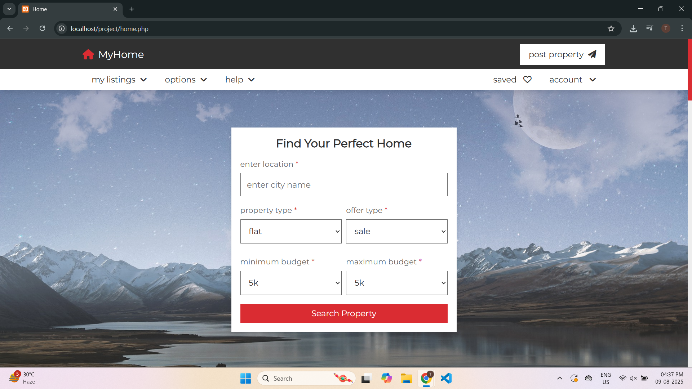
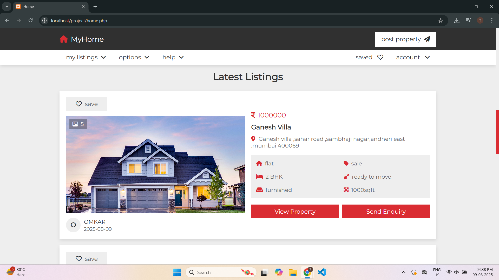
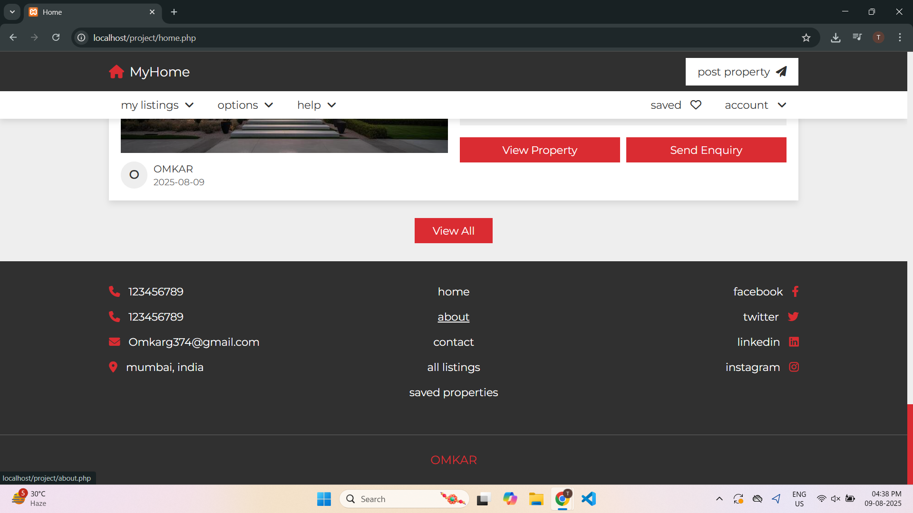
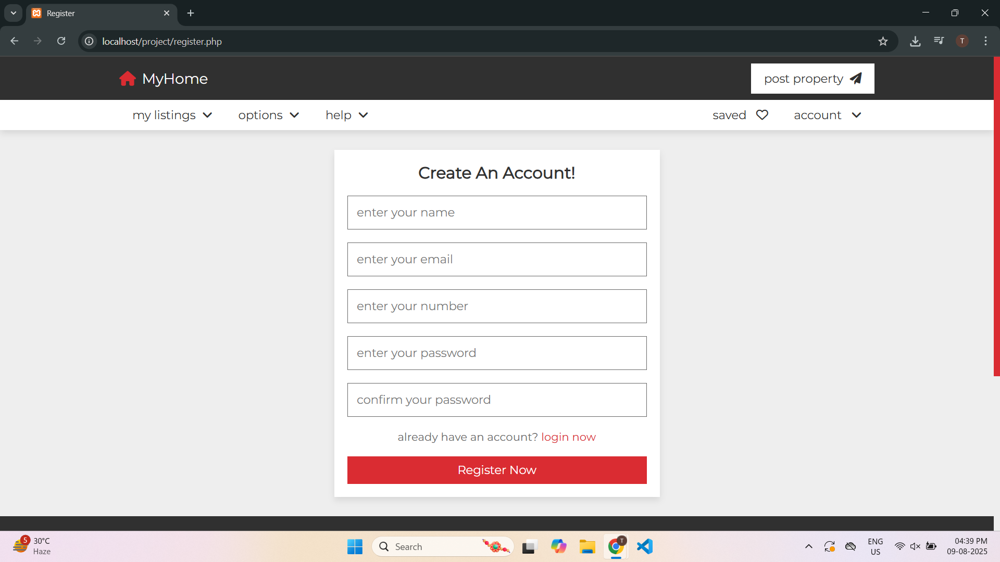
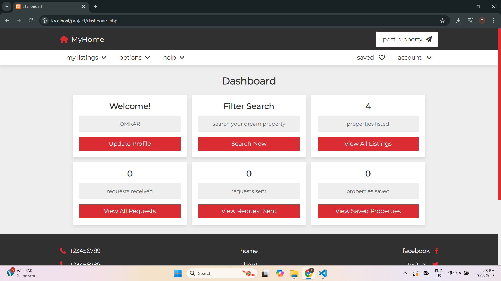
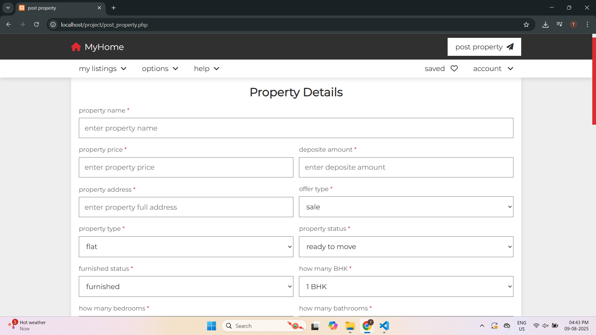

# Real-Estate Website

Welcome to my Electronics Real-Estate Website project repository! This project is built using HTML, CSS, JavaScript, PHP & MySQL.

---

## Website Preview

  
  
  
  
  

---

## Features  
 🔐 User Authentication – Login, Registration & Social Login options
 🏠 Home Page – Clean and responsive UI with featured listings
 🔍 Search & Filter – Find properties by location, budget, or amenities
 📄 Property Listings & Details – Organized property browsing with full details
 ❤️ Saved Listings – Save and manage favorite properties

## Admin Panel Functionalities:
 📊 Dashboard Overview – Monitor listings, user activity & inquiries
 👤 Admin Profile Management – Update profile and credentials
 🏘️ Property Management – Add, edit, or remove property listings
 👥 User & Agent Management – Handle user and agent accounts
 📈 Lead Management – Track and respond to property inquiries
